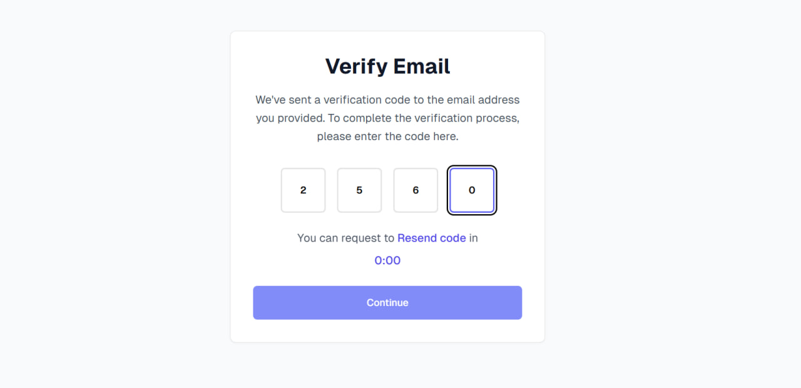
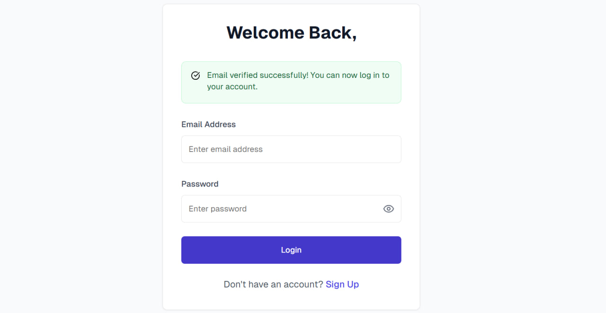

# Job Opportunities Platform

A modern job opportunities platform built with Next.js, TypeScript, and Tailwind CSS. This application allows users to browse job opportunities, create accounts, and manage their authentication state.

## Features

### 🔍 Job Opportunities

- Browse and search through available job opportunities
- View detailed job descriptions, requirements, and company information
- Sort opportunities by relevance, date, or deadline
- Responsive card-based layout matching professional designs

### 🔐 Authentication System

- User registration with email verification
- Secure login/logout functionality
- Email verification with OTP (One-Time Password)
- Protected routes and user session management
- Form validation and error handling

### main page

### sign up

### verify email

### login

## Tech Stack

- **Framework**: Next.js 14 (App Router)
- **Language**: TypeScript
- **Styling**: Tailwind CSS
- **UI Components**: shadcn/ui + Radix UI
- **Icons**: Lucide React
- **Fonts**: Geist Sans

## API Integration

The application integrates with the following API endpoints:

- **Base URL**: `https://akil-backend.onrender.com`
- **Opportunities**: `/opportunities/search` (GET)
- **Opportunity Details**: `/opportunities/:id` (GET)
- **User Registration**: `/signup` (POST)
- **Email Verification**: `/verify-email` (POST)
- **User Login**: `/login` (POST)

## Getting Started

### Prerequisites

- Node.js 18+
- npm or yarn package manager

### Installation

1. **Clone the repository**
   \`\`\`bash
   git clone <repository-url>
   cd job-opportunities
   \`\`\`

2. **Install dependencies**
   \`\`\`bash
   npm install
   \`\`\`

3. **Run the development server**
   \`\`\`bash
   npm run dev
   \`\`\`

4. **Open your browser**
   Navigate to [http://localhost:3000](http://localhost:3000)

### Build for Production

\`\`\`bash
npm run build
npm start
\`\`\`

## Project Structure

\`\`\`
job-opportunities/
├── app/ # Next.js App Router pages
│ ├── login/ # Login page
│ ├── signup/ # Registration page
│ ├── verify-email/ # Email verification page
│ ├── opportunities/[id]/ # Job opportunity details
│ ├── layout.tsx # Root layout
│ ├── page.tsx # Home page (opportunities list)
│ └── globals.css # Global styles
├── components/ # Reusable components
│ ├── ui/ # shadcn/ui components
│ ├── opportunity-card.tsx # Job opportunity card component
│ └── protected-route.tsx # Route protection component
├── contexts/ # React contexts
│ └── auth-context.tsx # Authentication context
├── lib/ # Utility functions
│ ├── api.ts # Opportunities API functions
│ ├── auth-api.ts # Authentication API functions
│ └── utils.ts # General utilities
├── types/ # TypeScript type definitions
│ ├── opportunity.ts # Opportunity-related types
│ └── auth.ts # Authentication types
└── README.md # This file
\`\`\`

## Environment Variables

No environment variables are required for basic functionality as the API endpoints are hardcoded. For production deployment, consider adding:

\`\`\`env
NEXT_PUBLIC_API_BASE_URL=https://akil-backend.onrender.com
\`\`\`
